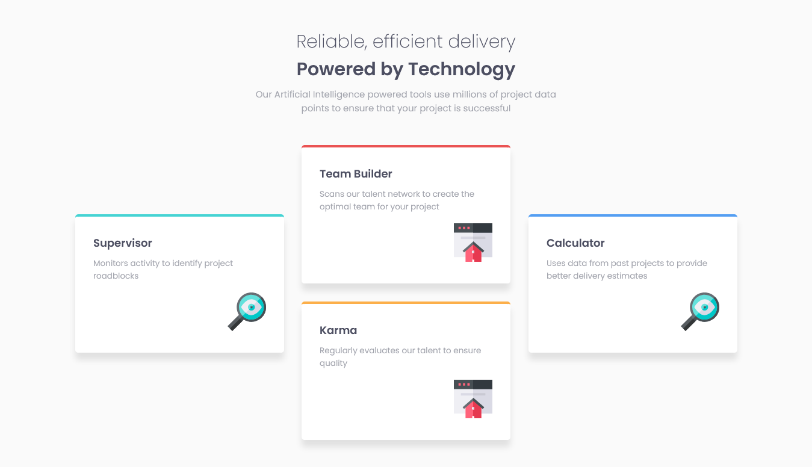

# Frontend Mentor - Four card feature section solution

This is a solution to the [Four card feature section challenge on Frontend Mentor](https://www.frontendmentor.io/challenges/four-card-feature-section-weK1eFYK). Frontend Mentor challenges help you improve your coding skills by building realistic projects.

## Table of contents

- [Overview](#overview)
- [The challenge](#the-challenge)
- [Screenshot](#screenshot)
- [Links](#links)
- [My process](#my-process)
- [Built with](#built-with)
- [What I learned](#what-i-learned)
- [Useful resources](#useful-resources)
- [Author](#author)

## Overview

This is a simple 4 card layout challenge. I found this challenge on frontendmentor.io and then tried this by myself to boost my css skills.

### The challenge

Users should be able to:

- View the optimal layout for the site depending on their device's screen size

### Screenshot

### Links

- Solution URL: [Github](https://github.com/pranto-bapary/four-card-feature-section)
- Live Site URL: [Github Pages](https://pranto-bapary.github.io/four-card-feature-section)

### Built with

- Semantic HTML5 markup
- SASS
- CSS Grid
- CSS Flexbox
- CSS custom properties
- Mobile-first workflow
- No library used

### What I learned

By doing this challenge I've learned how to position the child elements properly using css grid and also learned how to exchange their positions and how to responsive using css grid properly.

### Useful resources

- [W3Schools](https://www.w3schools.com) - I used this website to learn Css Grid and it helped me to learn that properly.

## Author

- Website - [Pranto Bapary](https://www.facebook.com/ashfe.pranto)
